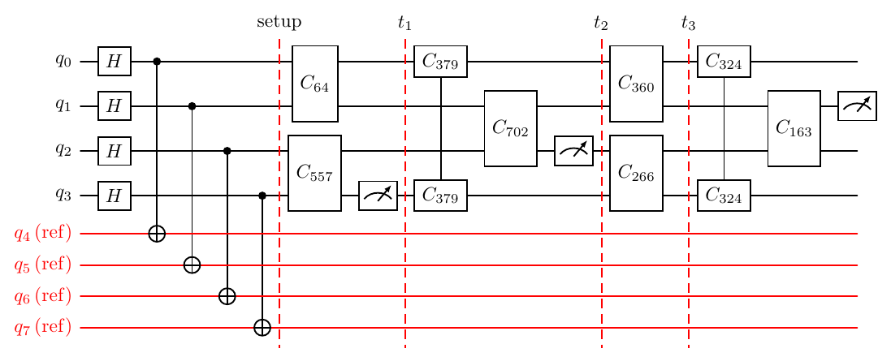
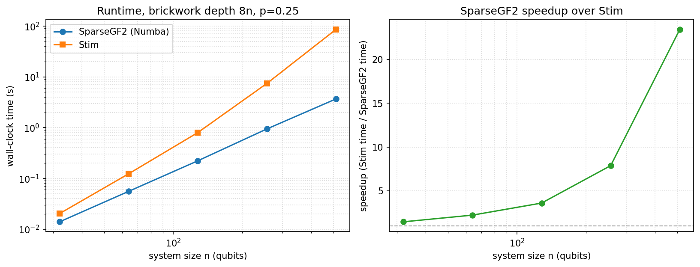
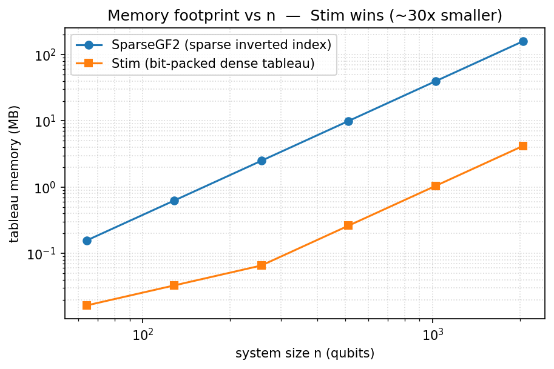

# SparseGF2

A phase-free sparse stabilizer simulator over $\mathbb{F}_2$ for measurement-induced
phase transition (MIPT) research on random Clifford circuits. It stores the
Aaronson-Gottesman tableau sparsely, so a measurement is a cheap rank update
instead of a dense $O(n^2)$ step. That makes it fast in the measurement-heavy
regime where the stabilizers stay low weight (see [SparseGF2 vs Stim](#sparsegf2-vs-stim)).

## Getting started

This assumes you already have **git** and **Python 3.12 or newer**. Use the
latest stable Python you have; the simulator and the full test suite run on it,
and so do the optional Stim benchmarks (Stim is an extra, not a runtime
dependency). Check your version with `python3 --version` (macOS/Linux) or
`py --version` (Windows). Every command below runs in a terminal.

### 1. Get the code

```sh
git clone https://github.com/sjbevins/SparseGF2.git
cd SparseGF2
```

### 2. Create and activate a virtual environment

A virtual environment keeps SparseGF2's dependencies separate from the rest of
your system. Create one, then **activate** it so that `python`, `pip`, and
`jupyter` in this terminal all use it. Once active, your prompt starts with
`(.venv)`.

macOS / Linux:
```sh
python3 -m venv .venv          # or pin a version, e.g. python3.14 -m venv .venv
source .venv/bin/activate
```

Windows (PowerShell):
```powershell
py -m venv .venv
.venv\Scripts\Activate.ps1
```
(If PowerShell blocks the script, run `Set-ExecutionPolicy -Scope CurrentUser RemoteSigned` once, then activate again. In `cmd.exe` use `.venv\Scripts\activate.bat`.)

Run `deactivate` to leave it. In a new terminal, `cd` back into the repo and run
the activate command again to reconnect.

### 3. Install

With the venv active (you see `(.venv)`):

```sh
pip install -e ".[dev]"
```

That installs the simulator, the analysis layer, plotting, and the notebook
tooling. To also run the Stim cross-check and the SparseGF2-vs-Stim benchmarks,
add the `stim` extra:

```sh
pip install -e ".[dev,stim]"
```

### 4. Check it works

```sh
python -c "import sparsegf2; print(sparsegf2.__version__, sparsegf2.__file__)"
python -m pytest
```

The printed path should be inside this repo's `src/sparsegf2/`. If it points
elsewhere, this terminal is not using the venv: re-run the activate command from
step 2. `pytest` should report all passed; the Stim-parity tests show as skipped
unless you installed the `stim` extra.

### 5. Your first script

With the venv active, create a file `first.py`:

```python
from sparsegf2.circuits import CircuitConfig, simulate

# one monitored circuit in the purification picture. code_dimension is the MIPT
# order parameter (logical qubits still protected); entropy_half_cut is the
# half-system entanglement.
rec = simulate(CircuitConfig(graph_spec="cycle", n=64, picture="purification", p=0.08),
               sample_seed=0)
print(rec.code_dimension, rec.entropy_half_cut)   # e.g. 14 15
```

Run it:
```sh
python first.py
```

### 6. Your first notebook

A notebook runs against its **kernel's** environment, not your terminal's, so you
have to point Jupyter at this venv. Skipping that is the usual cause of
`ImportError: cannot import name 'simulate' from 'sparsegf2.circuits'` (the
notebook's kernel resolves `import sparsegf2` to some other install).

The simplest way: launch Jupyter **from the activated venv**, and the notebook
uses this Python automatically:

```sh
jupyter lab          # or: jupyter notebook
```

To use it in VS Code, or to reuse a Jupyter you already run, register the venv as
a named kernel (with the venv active), then select it:

```sh
python -m ipykernel install --user --name sparsegf2 --display-name "SparseGF2"
```

Pick the **SparseGF2** kernel (the kernel picker in JupyterLab, or "Select
Kernel" in VS Code). Confirm you are on the right one in the first cell:

```python
import sparsegf2
print(sparsegf2.__file__)   # must be inside .../SparseGF2/src/sparsegf2/
```

If that path is wrong, you are on the wrong kernel: switch to **SparseGF2** (or
launch Jupyter from the activated venv) and restart the kernel.

### Optional extras

The runtime floor is just `numpy>=2` and `numba>=0.60`. Everything else is an
optional extra, installed with `pip install -e ".[<name>]"`:

| extra | pulls | for |
|---|---|---|
| `viz` | `matplotlib` | study plotting (`plot_study`); circuit diagrams use LaTeX/quantikz, not this |
| `graph` | `networkx` | arbitrary geometry via `from_networkx` |
| `data` | `pyarrow`, `h5py`, `pandas` | on-disk sweeps and studies |
| `parallel` | `joblib` | multi-process sweeps (`n_jobs > 1`) |
| `progress` | `tqdm`, `ipywidgets` | a live progress bar (`sweep(progress=True)`) |
| `analysis` | `graph` + `data` + `parallel` + `progress` + `scipy` | the full analysis and finite-size-scaling layer |
| `test` | `pytest` | run the test suite |
| `lint` | `ruff` | linting + formatting (`ruff check` / `ruff format`) |
| `stim` | `stim` | the Stim cross-check tests and the SparseGF2-vs-Stim benchmarks |
| `notebook` | `ipykernel`, `jupyter`, `nbformat`, `nbclient` | running the notebooks |
| `dev` | `test` + `lint` + `notebook` + `viz` + `analysis` (not `stim`) | development |

`stim` is kept separate so the simulator and test suite install on any supported
Python even when Stim has no wheel for it yet; the Stim-parity tests skip without
it. Add `,stim` (e.g. `pip install -e ".[dev,stim]"`) to run them and the
benchmarks.

## Quick start

**The simulator.** `SparseGF2(n)` is a pure $|0^n\rangle$ state on exactly $n$
qubits, with no implicit purification and no sign bits.

```python
import numpy as np
from sparsegf2 import SparseGF2, entanglement_entropy

sim = SparseGF2(4, rng=np.random.default_rng(0))
sim.apply_h(0)
sim.apply_cx(0, 1); sim.apply_cx(1, 2); sim.apply_cx(2, 3)
print(entanglement_entropy(sim, [0, 1]))   # bipartite entropy in ebits
out = sim.measure_z(0)                      # project; returns a phase-free bit
```

Key observables: `entanglement_entropy`, `single_qubit_entropy`, `mutual_information`,
`tripartite_mutual_info`, `code_dimension`, `code_rate`, `contiguous_distance`,
`stabilizer_weight_spectrum`; `sim.active_count()` gives the tableau-density
diagnostic `a_bar` (also recorded per circuit run as `mean_active_generators`).
Top-level exports are listed in the `__all__` of
[`src/sparsegf2/__init__.py`](src/sparsegf2/__init__.py). The public subpackage
APIs are likewise listed in [`circuits`](src/sparsegf2/circuits/__init__.py),
[`analysis`](src/sparsegf2/analysis/__init__.py), and
[`expurgation`](src/sparsegf2/expurgation/__init__.py).

**Circuits.** The `circuits` package builds graph-defined random Clifford and
measurement circuits.

```python
from sparsegf2.circuits import CircuitConfig, simulate

cfg = CircuitConfig(
    graph_spec="cycle",       # also "watts_strogatz(k=2,beta=0.1)" or any nx.Graph
    n=32,
    picture="purification",   # "pure_state" | "purification" | "single_ref"
    gating_mode="brickwork",  # "brickwork" | "random_edge" | "random_pool" | "all_edges"
    measurement_mode="bernoulli",  # "bernoulli" | "gated" | "random_pair" | "uniform_count"
    p=0.16,
    depth_factor=8,
)
rec = simulate(cfg, sample_seed=0)
print(rec.code_dimension, rec.entropy_half_cut)
```

Use `gating_mode="all_edges"` to fire the graph's complete stored edge list on
every layer. `total_layers_override=T` requests a literal measured-layer count.
For depth-resolved observables, pass `checkpoint_layers=[...]` to `simulate`;
add a read-only `checkpoint_callback` to compute values on the live tableau
without saving each full checkpoint. A callback may return the public sentinel
`from sparsegf2.circuits import CHECKPOINT_STOP` to end the run after that
checkpoint without storing the sentinel as a value.

**Studies.** The `sparsegf2.analysis` layer sweeps parameters and persists the
results. You can compute observables online (and discard each tableau) or save
the tableaux and add observables later without re-simulating.

```python
from sparsegf2.circuits import CircuitConfig
from sparsegf2.analysis import Study, plot_study

base = CircuitConfig(graph_spec="cycle", n=32, picture="purification", p=0.1, depth_factor=8)
study = Study.run("runs/transition", base,
                  grid={"n": [16, 32], "p": [0.05, 0.1, 0.15, 0.2]}, seeds=50,
                  analyses=["code_dimension"], save_tableaux=True, progress=True)
study.augment(["code_rate", "contiguous_distance"])   # add observables later, keyed merge
plot_study(study, out="transition.png")               # auto-detects every column
```

## Looking at circuits

Circuit diagrams are drawn with the [quantikz2](https://arxiv.org/abs/1809.03842)
LaTeX/TikZ package, so they drop straight into a paper. Each box is a gate
(`H`/CX for the Bell-pair setup, `C[index]` for a random
$\mathrm{Sp}(4,\mathbb{F}_2)$ Clifford), each meter is a measurement that fired,
and dashed `setup` / `t_1, t_2, …` separators mark the individual timesteps.
**System qubits are black wires, the reference register is red**, so the
Bell-paired references are unmistakable.



In a notebook, call `draw_circuit(cfg)` as the **last line of a cell** to show the
diagram inline (it returns an image; if it is not the last line, wrap it as
`display(draw_circuit(cfg))`). `save_circuit` writes a file, and
`circuit_to_quantikz` returns the LaTeX without needing a compiler:

```python
from IPython.display import display
from sparsegf2.circuits import CircuitConfig, draw_circuit, save_circuit, circuit_to_quantikz

cfg = CircuitConfig(graph_spec="cycle", n=4, picture="purification",
                    gating_mode="brickwork", measurement_mode="bernoulli", p=0.3)

display(draw_circuit(cfg, max_layers=4))         # inline in a Jupyter notebook
save_circuit(cfg, "circuit.png", max_layers=4)   # write a PNG/PDF (needs pdflatex + quantikz)
latex = circuit_to_quantikz(cfg, max_layers=4)   # the LaTeX string, no compiler needed
```

Each call draws a fresh random realization (different Cliffords and measured
qubits), so re-running the cell shows a new example; pass `sample_seed=...` to
lock a specific one (the chosen seed is reported in `inspect_circuit`'s summary).
When the config sets `scramble=True`, the global random Clifford is drawn as one
block over the system qubits it acts on. For `single_ref`, setting
`scramble_entangled_qubit=False` holds the probe qubit (the reference's Bell
partner) out of that block, so it stays localized until the monitored dynamics
spread it.

Compiling needs a LaTeX install (TeX Live ships `quantikz`) plus a PDF→PNG tool
(`pdftoppm`, `sips`, or ImageMagick) for `.png`; without LaTeX you still get the
`.tex`/string to compile elsewhere (e.g. Overleaf).

Rendered examples for the gallery configurations live under
[docs/figures/gallery/](docs/figures/gallery/) and are regenerated by
`python docs/figures/circuit_gallery.py`. The matching examples pair with a
uniform measurement set, since when a brickwork layer gates every qubit the
`gated` candidate set is identical to measuring everything.

A text view (`inspect_circuit(cfg)`) and a CLI (`python scripts/inspect_circuit.py`)
read the same trace, so all three always agree.

## Running at scale (HPC)

Large studies run headless on a cluster with no code changes. The pieces:

- **Fill the allocation.** `n_jobs=-1` resolves through the scheduler allocation
  (`SLURM_CPUS_PER_TASK`, the CPU affinity mask, then `cpu_count`), so a job that
  reserves part of a node uses exactly its cores without oversubscribing.
  `sparsegf2.analysis.available_cores()` returns that number if you want it.
- **No progress bars in logs.** Set `SPARSEGF2_PROGRESS=0` once in the job script
  and every sweep and study runs silently, regardless of any `progress=True` in
  the code, so batch logs stay clean.
- **Resumable, crash-safe.** A `Study` writes its rows to disk as it goes and
  skips chunks already on disk, so a re-queued job never redoes finished work.
  The crash-only log under `runs/<study>/logs` names the exact cell if a run
  dies.
- **Many nodes via job arrays.** Split the work into one resumable `Study` per
  chunk and run a SLURM array, one task per chunk across nodes.
  [`scripts/hpc_sweep_array.py`](scripts/hpc_sweep_array.py) and
  [`scripts/hpc_sweep_array.sbatch`](scripts/hpc_sweep_array.sbatch) are a
  copy-pasteable template: each array task takes a stride-slice of the chunk
  list and fills its own cores.

```bash
export SPARSEGF2_PROGRESS=0
sbatch --array=0-7 --cpus-per-task=32 scripts/hpc_sweep_array.sbatch
```

## SparseGF2 vs Stim

[Stim](https://github.com/quantumlib/Stim) is a state-of-the-art dense-tableau
simulator. The two simulators trade off differently, and which one wins depends
on the regime. The mechanism behind that trade-off is the one Aaronson and
Gottesman identified for the CHP algorithm:

> Thus, Figure 2 gives striking evidence for a "phase transition" in simulation
> time, as increasing the number of unitary gates by only a constant factor
> shifts us from a regime of simple states that are easy to measure, to a regime
> of complicated states that are hard to measure.

SparseGF2 exploits exactly that. In the measurement-heavy (area-law) regime the
stabilizers stay low weight, the state is "simple," and each measurement is
cheap. Stim pays a dense $O(n^2)$ cost per step regardless of state complexity,
so it is the better choice for complicated (volume-law) states, and it always
wins on memory.

For the volume-law regime, SparseGF2 has its own dense path: pass
`hybrid=True` and it monitors the stabilizer density and **switches to a
bit-packed dense representation** when the state becomes complicated, switching
back to sparse when measurements thin it out. You get the sparse engine's edge in
the area-law regime and a Stim-style dense cost in the volume-law regime, from a
single object, with no change to the results:

```python
sim = SparseGF2(n, hybrid=True)                 # core simulator
study = Study.run(..., base_config=CircuitConfig(..., hybrid=True))  # whole study
```

It is ~2.5-3× faster than the pure-sparse engine on low-`p` (volume-law) circuits
and within noise of it in the area-law regime. The physical state and every
gauge-invariant observable are identical either way (`hybrid=False` is the
default).

### Runtime

Nearest-neighbor brickwork random Cliffords with $Z$-measurements at $p=0.25$,
run to depth $8n$. The same circuit is replayed in Stim for a like-for-like
wall-clock comparison. SparseGF2's advantage grows with $n$ because the per-step
saving compounds over the circuit.



| $n$ | depth | SparseGF2 | Stim | speedup |
|----:|------:|----------:|-----:|--------:|
| 32  | 256  | 0.014 s | 0.020 s | 1.5x |
| 64  | 512  | 0.056 s | 0.123 s | 2.2x |
| 128 | 1024 | 0.222 s | 0.798 s | 3.6x |
| 256 | 2048 | 0.942 s | 7.42 s  | 7.9x |
| 512 | 4096 | 3.68 s  | 86.1 s  | 23.4x |

Reproduce with the committed script (it builds the matched circuit, times both
backends, and writes the figure). It needs the `stim` extra
(`pip install -e ".[dev,stim]"`):

```sh
python docs/figures/benchmark_runtime.py
```

### Memory

This is where Stim wins, at every size. Stim stores a bit-packed dense tableau
($\sim n^2$ bytes). SparseGF2's inverted-index structure is sized to the worst
case (several integer arrays of shape $\sim(2n, n)$), so it uses roughly 30x
more memory. That is the price of the sparse fast path for measurement.



```sh
python docs/figures/benchmark_memory.py
```

The core of that measurement is the exact data-structure size:

```python
from sparsegf2 import SparseGF2
import math

def sparsegf2_bytes(n):   # sum the actual tableau arrays
    s = SparseGF2(n)
    arrays = ("plt","supp_q","supp_len","supp_pos","inv","inv_len","inv_pos",
              "inv_x","inv_x_len","inv_x_pos")
    return sum(getattr(s, a).nbytes for a in arrays if hasattr(s, a))

def stim_bytes(n):        # bit-packed tableau (2n generators, padded to 256-bit words)
    return 2 * (2*n) * 2 * (math.ceil(n/256) * 32)
```

## How it works

A pure stabilizer state on $n$ qubits is fixed by $n$ independent stabilizer
generators. The Aaronson--Gottesman tableau carries those $n$ rows together
with $n$ paired destabilizer rows, each represented by a Pauli vector
$[x \mid z]$ over $\mathbb{F}_2$. SparseGF2 stores all $2n$ tableau rows
**sparsely**: for each row it keeps the list of qubits it acts on, and for each
qubit it keeps the list of rows that touch it (an inverted index). A two-qubit
gate or a $Z$-measurement only needs the rows supported on the qubits involved,
which the inverted index returns in $O(1)$. A measurement is then a rank update
whose cost is
(number of anticommuting generators) $\times$ (their weight), not the dense
$O(n^2)$ of a full tableau sweep. When measurements keep the stabilizers short,
this is far cheaper.

Two deliberate choices set it apart from Stim:

- **Phase-free.** Only the symplectic part is tracked; sign bits are dropped.
  Every observable built from the GF(2) row span (rank, entanglement entropy,
  mutual information, code dimension, weight spectrum) is exact. Signed Pauli
  expectations $\langle\psi|P|\psi\rangle$ are not available, so use Stim for
  those.
- **Sparse, not dense.** Stim's bit-packed tableau is optimal for dense states
  and minimal in memory. SparseGF2 trades memory for speed in the regime where
  the state stays simple, which is the regime MIPT studies live in.

No path under `src/` imports Stim. The two-qubit Clifford table is built natively
from $\mathrm{Sp}(4,\mathbb{F}_2)$, and Stim is used only as a test-time
cross-checker (every circuit is checked against it by GF(2) RREF).

## More

- **Analysis and studies.** Online vs offline analysis, the augmentable `Study`
  database, and plotting are covered in
  [`notebooks/analysis.ipynb`](notebooks/analysis.ipynb). Built-in observables
  are listed in [`src/sparsegf2/analysis/__init__.py`](src/sparsegf2/analysis/__init__.py).
- **Expurgation.** `sparsegf2.expurgation` implements the code-surgery
  algorithm of [Gullans et al., PRX 11, 031066 (2021)](https://arxiv.org/abs/2010.09775),
  Sec. VI, natively on the tableau: find the error operators an encoded code
  cannot correct and measure them away, trading rate for distance and erasure
  recovery. Built on the core's general `SparseGF2.measure_pauli` kernel and
  agnostic to how the tableau was generated. See
  [`src/sparsegf2/expurgation/README.md`](src/sparsegf2/expurgation/README.md).
- **Reproducible paper campaigns.** The versioned protocols, production
  drivers, graph registry, and analysis recipes used for current paper runs
  live in [`studies/prl_production/`](studies/prl_production/README.md). This
  includes a generalized, plan-first single-reference purification-time runner
  over Cartesian graph-parameter grids, with exact measurement-rate grids,
  raw per-graph/per-circuit results, resumable storage, a searchable artifact
  catalog, a standalone flowchart, and a production benchmark protocol.
  Generated trajectories and large numerical artifacts remain local.
- **Notebooks** (executable, with the math worked out):
  [`master.ipynb`](notebooks/master.ipynb) (the core walkthrough),
  [`analysis.ipynb`](notebooks/analysis.ipynb) (run a study end to end),
  [`benchmarks.ipynb`](notebooks/benchmarks.ipynb), and the per-module
  [`notebooks/circuits/`](notebooks/circuits/) set.
- **Project map:**
  ```
  src/sparsegf2/
  ├── core/         the simulator: sparse_tableau, numba_kernels, symplectic, observables, linalg_gf2
  ├── circuits/     graph-defined MIPT circuits: picture, graphs, matching, measurements, scheduler, runner, draw
  ├── analysis/     online/offline analysis, parameter sweeps, studies, plotting
  └── expurgation/  Gullans et al. code surgery on the tableau: roles, erasure decoding, the loop
  scripts/         inspect_circuit.py, plot_study.py
  benchmarks/      SparseGF2-vs-Stim and per-optimization performance scripts
  docs/figures/    the figures in this README and the scripts that produce them
  studies/prl_production/  fingerprinted production protocols, runners, and analysis
  ```

## References

- Aaronson and Gottesman, *Improved Simulation of Stabilizer Circuits*,
  [PRA 70, 052328 (2004)](https://arxiv.org/abs/quant-ph/0406196).
- Fattal et al., *Entanglement in the Stabilizer Formalism*,
  [quant-ph/0406168](https://arxiv.org/abs/quant-ph/0406168).
- Gullans and Huse, *Dynamical Purification Phase Transition Induced by Quantum
  Measurements*, [PRX 10, 041020 (2020)](https://arxiv.org/abs/1905.05195).

## License

MIT. See the `[project] license` field in [pyproject.toml](pyproject.toml).
