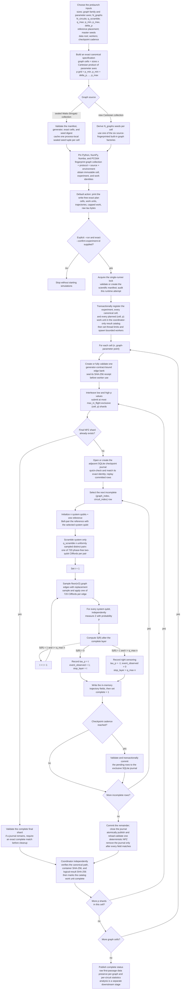

# Raw single-reference production flow

```mermaid
flowchart TB
    A["Choose the prelaunch inputs<br/>sizes; graph family and parameter axes; N_graphs<br/>N_circuits; q_scramble; q_max; p_min, p_max, delta_p<br/>reference placement; master seeds<br/>data root; workers; checkpoint cadence"]
    A --> B["Build an exact canonical specification<br/>graph cells = sizes x Cartesian product of parameter axes<br/>p grid = p_min, p_min + delta_p, ..., p_max"]
    B --> C{"Graph source"}
    C -->|"sealed Watts-Strogatz collection"| D["Validate the manifest, generator, exact cells, and seed digest<br/>cache one process-local sealed seed tuple per cell"]
    C -->|"new Cartesian collection"| E["Derive N_graphs seeds per cell<br/>use one of the six source-fingerprinted built-in graph factories"]
    D --> F["Pin Python, NumPy, Numba, and PCG64<br/>fingerprint graph collection + protocol + source + environment<br/>obtain immutable cell, experiment, and work identities"]
    E --> F
    F --> FA["Default action: print the write-free exact plan<br/>cells, work units, trajectories, capped work, raw tau bytes"]
    FA --> FB{"Explicit --run and exact<br/>--confirm-experiment-id supplied?"}
    FB -->|no| FC["Stop without starting simulations"]
    FB -->|yes| FD["Acquire the single-runner lock<br/>validate or create the scientific manifest; audit this runtime attempt"]
    FD --> FE["Transactionally register the experiment, every canonical cell,<br/>and every planned (cell, p) work unit in the coordinator-only result catalog<br/>then set thread limits and spawn bounded workers"]

    FE --> G["For each cell (n, graph-parameter point)"]
    G --> H["Create or fully validate one generator-contract-bound edge bank<br/>seal its SHA-256 receipt before worker use"]
    H --> I["Interleave low and high p values<br/>submit at most max_in_flight exclusive (cell, p) shards"]
    I --> J{"Final NPZ shard<br/>already exists?"}
    J -->|yes| K["Validate the complete final shard<br/>if a journal remains, require an exact complete match before cleanup"]
    J -->|no| L["Open or create the adjacent SQLite checkpoint journal<br/>quick-check and match its exact identity; replay committed rows"]
    L --> M["Select the next incomplete<br/>(graph_index, circuit_index) row"]

    M --> N["Initialize n system qubits + one reference<br/>Bell-pair the reference with the selected system qubit"]
    N --> O["Scramble system only<br/>q_scramble n uniformly sampled distinct pairs<br/>one of 720 phase-free two-qubit Cliffords per pair"]
    O --> P["Set t = 1"]
    P --> Q["Sample floor(n/2) graph edges with replacement<br/>sample and apply one of 720 Cliffords per edge"]
    Q --> R["For every system qubit, independently<br/>measure Z with probability p"]
    R --> S["Compute S(R) after the complete layer"]
    S -->|"S(R) = 0"| T["Record tau_p = t<br/>event_observed = 1; stop_layer = t"]
    S -->|"S(R) = 1 and t < q_max n"| U["t = t + 1"]
    U --> Q
    S -->|"S(R) = 1 and t = q_max n"| V["Record right censoring<br/>tau_p = -1; event_observed = 0<br/>stop_layer = q_max n"]
    T --> W["Write the in-memory trajectory fields, then set complete = 1"]
    V --> W
    W --> X{"Checkpoint cadence reached?"}
    X -->|yes| Y["Validate and transactionally commit<br/>the pending rows to the exclusive SQLite journal"]
    X -->|no| Z{"More incomplete rows?"}
    Y --> Z
    Z -->|yes| M
    Z -->|no| AA["Commit the remainder; close the journal<br/>atomically publish and reload-validate one deterministic NPZ<br/>remove the journal only after every field matches"]
    K --> AAA
    AA --> AAA["Coordinator independently verifies the canonical path,<br/>container SHA-256, and logical-result SHA-256<br/>then marks the catalog work unit complete"]
    AAA --> AB{"More p shards<br/>in this cell?"}
    AB -->|yes| I
    AB -->|no| AC{"More graph cells?"}
    AC -->|yes| G
    AC -->|no| AD["Publish complete status<br/>raw first-passage data preserve per-graph and per-circuit statistics<br/>analysis is a separate downstream stage"]
```
